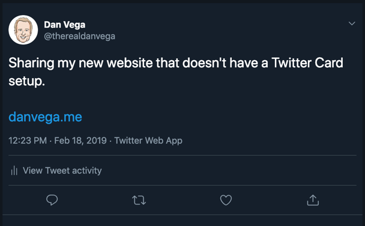
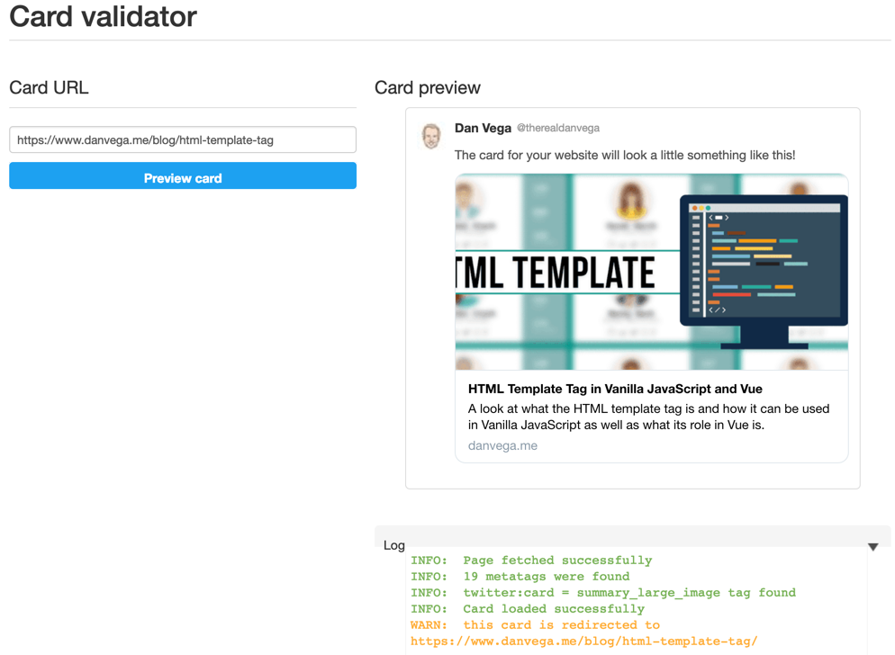

For those of you who haven't been reading my blog lately I am in the middle of converting my website from WordPress over to a static site generator called [Gridsome](https://gridsome.org/) that is built on VueJS. There are a lot of things that I took for granted when using a proven blogging platform like WordPress. In WordPress when I created a new blog post and then shared it on Twitter I got this nice display of my blog post as apposed to just a link. 

This might not seem like a big thing to most but why write something if nobody reads it? Engagement is the name of game on social media platforms like Twitter and Twitter Cards (and images in general) are proven to increase engagement. In this article I will tell you what a Twitter Card is and how to add how to add the appropriate meta tags to your blog.

## What is a Twitter Card

Before we dive into the technical details on how to add Twitter cards to your blog it might make sense to understand what a Twitter Card actually is. I currently don't have any Twitter Cards setup for the home page of my website. After sitting down to write this article I realize that I should fix that. If I share out a link of my homepage on Twitter it looks like this.



Pretty boring right? No matter what my message is you aren't going to be very compelled to click that link. 

Here is a recent blog post that I just posted a link to on Twitter. 


In this case you can see a nicely formatted card with a summary and an image. Now I will admit the image could use a little work as some text is running up against the side, but you get the idea. I think this is a real nice addition that you can add to your blog today and with just a few lines of code. 

## What are meta tags

If you're familiar with HTML chances are you have come across meta tags before. Metadata is data (information) about data. This means that the `<meta>` tag provides metadata about the HTML document. Metadata will not be displayed on the page, but will be machine parsable. This just means that it will not be displayed but it will exist in your pages source code.

Meta tags are defined in the `<head>` of an HTML document and contain the following attributes: 

| Attribute  | Value  |  Description |
|---|---|---|
| charset  | character_set  | Specifies the character encoding for the HTML document  |
| content  |  text          | Gives the value associated with the http-equiv or name attribute  |
| http-equiv  | content-type<br/>default-style<br/>refresh  | Provides an HTTP header for the information/value of the content attribute  |
| name | application-name<br/>author<br/>description<br/>generator<br/>keywords<br/>viewport | Specifies a name for the metadata | 

This is an example of what a meta tag looks like.

```html
<head>
    <meta name="description" content="Welcome to my website!">
</head>
```

### Meta Tag Use Cases

Now that you know what a meta tag it might be good to understand what they are useful for. Here are some of examples of meta tags that you might have come across already. 

```html
<head>
  <meta charset="UTF-8">
  <meta name="description" content="Welcome to my website!">
  <meta name="keywords" content="HTML,CSS,JavaScript">
  <meta name="author" content="Dan Vega">
  <meta name="viewport" content="width=device-width, initial-scale=1.0">
</head>
```

If you done any kind of Search Engine Optimization (SEO) you have probably come across the meta description.

> The meta description is a snippet of up to about 155 characters – a tag in HTML – which summarizes a page's content. Search engines show the meta description in search results mostly when the searched-for phrase is within the description, so optimizing the meta description is crucial for on-page SEO .

Most meta tags are nothing more than name and content, in fact you could create your own if you wanted to.


```html
<meta name="msg" content="hello meta tags"/>
```

While this is valid syntax it really doesn't do anything. If you were to write some program that scanned html looking for this specific meta tag than it would make sense to include, otherwise its useless. 

## Adding Twitter Cards to your blog or website

No that you know a little bit more about meta tags lets take that knowledge and apply it to Twitter Cards. The first meta tag you need to set is the twitter:card meta tag.

```html
<meta name="twitter:card" content="summary_large_image" />
```

This tag can have one of the following values

* [summary](https://developer.twitter.com/en/docs/tweets/optimize-with-cards/overview/summary)
* [summary_large_image](https://developer.twitter.com/en/docs/tweets/optimize-with-cards/overview/summary)
* [player](https://developer.twitter.com/en/docs/tweets/optimize-with-cards/overview/player-card)
* [app](https://developer.twitter.com/en/docs/tweets/optimize-with-cards/overview/app-card)

In my case and the example I showed you earlier of the blog post I am using **summary_large_image**. The other tags are pretty self explinatory if you compare them to the example card. The one thing I will say is that make sure you give the twitter:image tag the full path to the image you want to use. 

Here are all of the tags I used for that blog post and what it looks like.


``` html
<head>
  <meta name="twitter:card" content="summary_large_image" />
  <meta name="twitter:description" content="How to create your first npm package and publish it." />
  <meta name="twitter:title" content="Creating your first npm package" />
  <meta name="twitter:site" content="@therealdanvega" />
  <meta name="twitter:image" content="https://www.danvega.me/assets/static/npm_cover.bd64798.eced3da.png" />
  <meta name="twitter:creator" content="@therealdanvega" />
</head>
```


If you want to learn more about the different types of cards you can create and all of the options please read through the [documentation](https://developer.twitter.com/en/docs/tweets/optimize-with-cards/overview/abouts-cards).

### Twitter Card Validator

If you ever have problems with your Twitter Cards not displaying correctly there is a way to test them. You can use the Twitter Card Validator, plug in the url you want to test and see what the outcome is along with some debugging information. Here I have entered another blog post and I get a preview of what my twitter card is going to look like.



## Conclusion 

I mentioned this at the start of this article that I was converting my site from WordPress to Gridsome. If you're interested in how I added Twitter cards to this blog let me know. If you're also interested in how to add similar meta tags for other social networks you can do some research on open graph or just let me know that you would like to see another article on that. 

