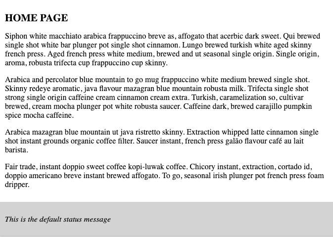
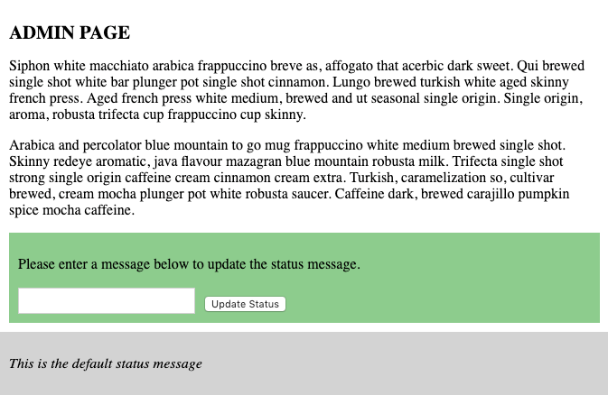

Last week I was working on tightening up our documentation on Vue Router and I was presented with an interesting challenge. In a short period of time our students are able to build some really cool applications using Vue. We teach them how components communicate with each other and introduce them to Vue Router.

The problem comes into play when you want to start triggering events from your views or even components within those views. In the real world you would start to see this as an obvious pain and look to see what others are using to solve this problem.

When this problem shows up you would probably reach for something like Vuex. In our situation we just don't have the time to include that in our curriculum so when it comes time for them to build their final capstone projects they need a way to trigger events in their views.

I put together a quick demo and had an a ha moment. When we want to trigger an event in any component we just emit one and listen for it on the parent component. In this case the view is just a component and the parent component is `<router-view>`. It's easy to forget but `<router-view>` is just a component.

I was pretty excited about this so I tweeted this out:

[https://twitter.com/therealdanvega/status/1134550365049937920](https://twitter.com/therealdanvega/status/1134550365049937920)

[Damian Dulisz](https://twitter.com/DamianDulisz) was quick to respond and remind me that because it was a component it can also accept props. That was the exact discussion we had at work and I was happy to hear we weren't alone in thinking that.

## Triggering events from Vue Router Demo

I'm not able to use the exact project that triggered this article but I was able to put together a simple example that should help explain the solution. If you want to skip ahead you can jump into the final solution on [CodeSandbox](https://codesandbox.io/s/trigger-event-views-p9oyt?fontsize=14).

### Demo Introduction

In our sample application we have a footer component that is constant throughout our application and it contains a status message.



In `App.vue` there is a `<router-view>` component that will display each of our views and below that you will include a component `TheFooter.vue`.

```html
<template>
  <div id="app">
    <ul class="nav">
      <router-link to="/">Home</router-link>|
      <router-link to="/admin">Admin</router-link>
    </ul>
    <router-view @updateStatus="updateStatus" class="content"/>
    <the-footer :status="status"/>
  </div>
</template>
```

The code for the footer component is pretty minimal.

```html
<template>
  <div class="footer">
    <p>{{ status }}</p>
  </div>
</template>

<script>
export default {
  name: "the-footer",
  props: {
    status: String
  }
};
</script>
```

What we want is the ability to change that status message from a component. The catch here is that the component (`StatusUpdate.vue`) is being used in another view called admin.



So to make this work you will need to trigger the event from the admin page up to the main App component and then pass that into the footer as a prop.

### Trigger events in router views

If you have worked with events before you know that you can emit an event so that any parent components are able to listen for it. To update the status you will type in the new status in the input field and click the button. When the button is clicked in our `StatusUpdate.vue` component it will emit an event called `updateStatus()`

```html
<template>
  <div class="update-status">
    <p>Please enter a message below to update the status message.</p>
    <input type="text" v-model="status">
    <button @click="$emit('updateStatus',status)">Update Status</button>
  </div>
</template>

<script>
export default {
  name: "status-message",
  data() {
    return {
      status: ""
    };
  }
};
</script>
```

The parent component is a view in `src/views/` called `Admin.vue`.  On the admin page you will import the status message component and display it on screen. When you emit an event it's only available in the components parent so to listen for it in `App.vue` you will need to bubble it up from Admin to App.

To make this work add an event listener to listen for the `updateStatus` event that will be emitted from the `UpdateStatus.vue` component. This will turn around and emit the `updateStatus` event to the parent component of Admin, which is our `<router-view>`.

```html
<template>
  <div class="admin">
    <h1>Admin Page</h1>
    <p>Siphon white macchiato arabica frappuccino breve as, affogato that acerbic dark sweet. Qui brewed single shot white bar plunger pot single shot cinnamon. Lungo brewed turkish white aged skinny french press. Aged french press white medium, brewed and ut seasonal single origin. Single origin, aroma, robusta trifecta cup frappuccino cup skinny.</p>
    <p>Arabica and percolator blue mountain to go mug frappuccino white medium brewed single shot. Skinny redeye aromatic, java flavour mazagran blue mountain robusta milk. Trifecta single shot strong single origin caffeine cream cinnamon cream extra. Turkish, caramelization so, cultivar brewed, cream mocha plunger pot white robusta saucer. Caffeine dark, brewed carajillo pumpkin spice mocha caffeine.</p>

    <status-message @updateStatus="updateStatus"/>
  </div>
</template>

<script>
import StatusMessage from "@/components/StatusMessage.vue";

export default {
  name: "admin",
  components: {
    StatusMessage
  },
  data() {
    return {};
  },
  methods: {
    updateStatus(status) {
      this.$emit("updateStatus", status);
    }
  }
};
</script>
```

Now in `App.vue` you can listen for `updateStatus` event on the `<router-view>` component. As I mentioned before it's just a component so this will work. You can now update the status and it will get passed into your footer using props.

```html
<template>
  <div id="app">
    <ul class="nav">
      <router-link to="/">Home</router-link>|
      <router-link to="/admin">Admin</router-link>
    </ul>
    <router-view @updateStatus="updateStatus" class="content"/>
    <the-footer :status="status"/>
  </div>
</template>

<script>
import TheFooter from "./components/TheFooter";

export default {
  name: "App",
  components: {
    TheFooter
  },
  data() {
    return {
      status: "This is the default status message"
    };
  },
  methods: {
    updateStatus(status) {
      this.status = status;
    }
  }
};
</script>
```

## CodeSandbox

If you're interested in checking out the final code for this project you can [click here](https://codesandbox.io/s/trigger-event-views-p9oyt?fontsize=14) or use the CodeSandbox embed below.

https://codesandbox.io/embed/trigger-event-views-p9oyt?fontsize=14&view=editor

## Conclusion

I think the important thing to remember here is that your components inside of the `/views` folder along with `<router-link>` and `<router-view>` are all just Single File Components at the end of the day. It's because of this that they can trigger and listen for events or act like any other component would. I hope this little tip helped make your day an easier one and as always....

Happy Coding
Dan
